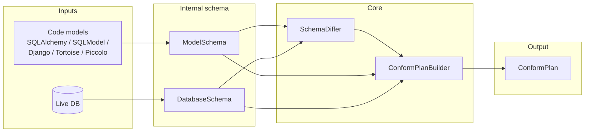

# Architecture (high level)

High-level data flow for comparing code models to a live database and producing a conform plan. See [docs/requirements/01-functional.md](../requirements/01-functional.md) for required behavior.

## Core functions

dbconform is organized around four distinct functions:

1. **Internal schema** — Defines a neutral, library-agnostic representation of a SQL table's schema (tables, columns, constraints, indexes). No dependency on SQLAlchemy, Django, or other ORMs.
2. **Adapters (ingest)** — Take well-known third-party models (SQLAlchemy, SQLModel; later Django, Tortoise, Piccolo) and produce the dbconform internal schema. Ingestion is **read-only**: we do not modify the caller's model classes or their `__table__` / columns. Column defaults from models are turned into SQL fragments for DDL; see [05-model-column-defaults.md](05-model-column-defaults.md) for behavior and an incident record (Python `date` defaults vs PostgreSQL).
3. **Compare** — Reflect a live database into the database-side internal schema and compare it to the model-side internal schema; produce a structured diff (added, removed, modified).
4. **DDL generation** — From the comparison result, build an ordered plan and generate dialect-specific DDL to bring the target database into parity with the model.

The following diagram and sections describe how these functions are wired together.

**Package layout:** The codebase is organized as subpackages under `dbconform`: `internal` (neutral schema types and type names), `adapters` (third-party model → internal), `compare` (DB reflection and diff), `plan` (diff → ordered steps), and `sql_dialect` (steps → DDL; includes `sqlite_rebuild` for SQLite table-rebuild logic when adding constraints). The `schema` package is retained as a backward-compatibility re-export of the public API from internal, adapters, and compare.

## Internal schema: design goals

The **internal schema** is dbconform’s intermediate representation of SQL schema. Its overarching goal:

- **Lightweight, frozen/immutable** — Table, Column, Index, Constraint (and related types) are minimal, immutable structures, so they are easy to compare, hash, and pass around without side effects. The current implementation uses frozen dataclasses (e.g. `@dataclass(frozen=True)`); the design requirement is immutability and minimal surface, not a specific Python mechanism.
- **Lingua franca** — A single representation that sits between **ORMs** (SQLAlchemy, SQLModel, Django, Tortoise, Piccolo) and **databases** (SQLite, PostgreSQL, MariaDB). Each side adapts to or from this representation; the core compare/diff and migration-generation logic speaks only the internal schema.
- **Analogous roles in other ecosystems:**
  - **AST** in compilers: universal intermediate representation between frontends (languages) and backends (targets).
  - **OpenAPI** for REST APIs: language- and implementation-agnostic contract for APIs.
  - **Protocol Buffers** as an IDL: neutral, well-defined schema for serialization and RPC.
- **Minimal, ORM-agnostic, DB-agnostic** — Only what is needed for **comparison and migration generation**. No ORM or database specifics; those are handled by adapters (model → internal) and dialects (internal → DDL / reflection → internal).

Keeping the internal schema minimal and immutable ensures it remains a stable, auditable basis for diff and plan building.

- **ModelSchema** / **DatabaseSchema**: Internal schema (lightweight, frozen/immutable) representation of tables, columns, constraints, and indexes so the two sides can be compared by name/identity. See "Internal schema: design goals" above.
- **SchemaDiffer**: Compares model-side internal schema to database-side internal schema; produces added, removed, modified, and extra (unmanaged) tables.
- **ConformPlanBuilder**: Builds an ordered list of DDL and data-operation steps from the diff, with dependency-safe ordering and configurable drop behavior. For SQLite, when adding CHECK/UNIQUE/FK constraints to existing tables, emits `RebuildTableStep` (table rebuild) when `allow_sqlite_table_rebuild=True`; otherwise records skipped steps in `plan.skipped_steps`.
- **DbConform** (facade): Library entry point; accepts connection or credentials and target schema, exposes `compare()` returning a **ConformPlan**. The plan includes `steps`, `extra_tables`, and `skipped_steps` (steps that could not be applied, e.g. SQLite constraint add when rebuild is disabled).

## Types

Column types are represented in the internal schema as **data_type_name** (a string on `ColumnDef`). Two explicit resolution strategies feed the same neutral vocabulary:

1. **Model ingestion → internal** (`_ingest_model_column_type`): SQLAlchemy column types are mapped to neutral names by class name (INTEGER, VARCHAR(n), JSONB, BLOB, etc.). This path does **not** compile types with the target dialect, so models may declare dialect-specific types (e.g. `postgresql.BYTEA`) and still ingest correctly when the conform target is another backend (BYTEA → neutral BLOB). When the conform target connection dialect is known, it is passed as `model_type_dialect` so `TypeDecorator` subclasses resolve via `load_dialect_impl()` (GitHub #10); without it, `TypeDecorator` uses its `impl`. Optionally, the backend Dialect's **normalize_reflected_table** rewrites the table so model-side strings match reflected-side normalization (e.g. SERIAL/nextval handling).
2. **Reflection → internal** (`_reflect_column_type`): Reflected columns are compiled with the connection dialect (`column.type.compile(reflection_dialect)`), producing platform type strings. The backend Dialect's **normalize_reflected_table** and **to_neutral_type** then rewrite columns to the same neutral strings as ingestion (e.g. `CHARACTER VARYING(255)` → `VARCHAR(255)`, SERIAL/nextval → `default=None`, `autoincrement=True`).
3. **Neutral → DDL**: When generating SQL, each Dialect maps **data_type_name** to platform-specific DDL (e.g. SQLite maps `JSONB` → `JSON`; PostgreSQL maps INTEGER + autoincrement PK → SERIAL, `BLOB` → `BYTEA`, `JSONB` → `JSONB`, `TIMESTAMPTZ` → `TIMESTAMPTZ`). Shared parsing (e.g. VARCHAR length) lives on the base Dialect (`_parse_varchar_length`).

Do not use the reflection compile path for model ingestion: compiling dialect-specific model types against the wrong backend fails (e.g. `BYTEA` on SQLite) and `TypeDecorator` names are not visible to the compiler without `load_dialect_impl`.

Neutral vocabulary includes distinct types where backends differ: e.g. `JSON` vs `JSONB`, `TIMESTAMP` vs `TIMESTAMPTZ`, and `BLOB` (binary) mapped per dialect.

A single neutral type set and per-dialect “to neutral” / “to DDL” mapping keeps comparison and DDL generation consistent and makes adding a new backend (e.g. MariaDB) a matter of implementing one Dialect.
