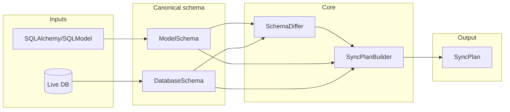

# Architecture (high level)

High-level data flow for comparing code models to a live database and producing a sync plan. See [docs/requirements/01-functional.md](../requirements/01-functional.md) for required behavior.

- **ModelSchema** / **DatabaseSchema**: Normalized representation of tables, columns, constraints, and indexes so the two sides can be compared by name/identity.
- **SchemaDiffer**: Compares model schema to DB schema; produces added, removed, modified, and extra (unmanaged) tables.
- **SyncPlanBuilder**: Builds an ordered list of DDL and data-operation steps from the diff, with dependency-safe ordering and configurable drop behavior.
- **ModelSync** (facade): Library entry point; accepts connection or credentials and target schema, exposes `compare()` returning a **SyncPlan**.
