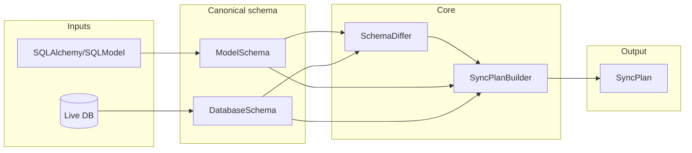

# Architecture (high level)

High-level data flow for comparing code models to a live database and producing a sync plan. See [docs/requirements/01-functional.md](../requirements/01-functional.md) for required behavior.

- **ModelSchema** / **DatabaseSchema**: Normalized representation of tables, columns, constraints, and indexes so the two sides can be compared by name/identity.
- **SchemaDiffer**: Compares model schema to DB schema; produces added, removed, modified, and extra (unmanaged) tables.
- **SyncPlanBuilder**: Builds an ordered list of DDL and data-operation steps from the diff, with dependency-safe ordering and configurable drop behavior.
- **ModelSync** (facade): Library entry point; accepts connection or credentials and target schema, exposes `compare()` returning a **SyncPlan**.

## Types

Column types are represented in the canonical schema as **type_expr** (a string on `ColumnDef`). The flow is:

1. **Model → canonical**: SQLAlchemy column types are compiled with the connection dialect (`column.type.compile(dialect)`), producing a type string. Optionally, a schema normalizer (modelsync Dialect) rewrites the table so type strings match a canonical form (e.g. PostgreSQL: `CHARACTER VARYING(255)` → `VARCHAR(255)`, `DOUBLE PRECISION` → `FLOAT`).
2. **Reflection → canonical**: Reflected tables are built from DB metadata (same compile); then the backend’s Dialect **normalize_reflected_table** rewrites columns so they compare equal to the model (e.g. SERIAL/nextval → `default=None`, `autoincrement=True`, canonical type string).
3. **Canonical → DDL**: When generating SQL, each Dialect maps **type_expr** to platform-specific DDL (e.g. SQLite uses type_expr as-is; PostgreSQL maps INTEGER + autoincrement PK → SERIAL). Shared parsing (e.g. VARCHAR length) lives on the base Dialect (`_parse_varchar_length`).

A single canonical type set and per-dialect “to canonical” / “to DDL” mapping keeps comparison and DDL generation consistent and makes adding a new backend (e.g. MariaDB) a matter of implementing one Dialect.
